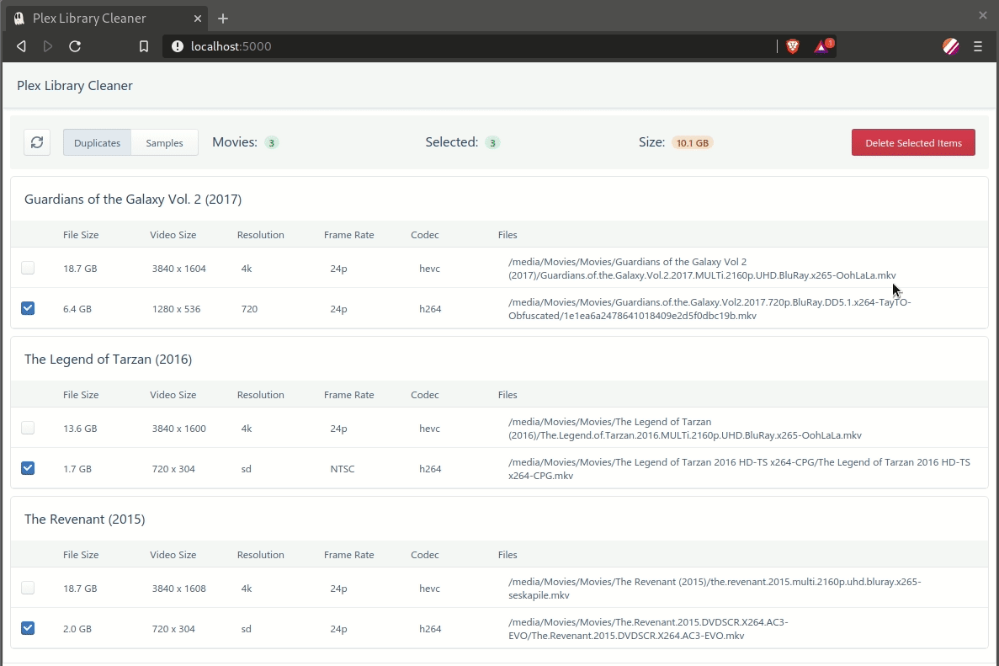

# Cleanarr

A simple UI to help find and delete duplicate and sample files from your Plex server.

> Note: At this time only Plex Content Libraries (TV/Movies) are supported.

## Plex Setup
You need to check `Settings | Library | Allow media deletion` within your plex server’s settings

You will need a Plex Token: [How to find your Plex Token](https://support.plex.tv/articles/204059436-finding-an-authentication-token-x-plex-token/)

## Run with Docker

This project is available as a docker container on [Docker Hub](https://hub.docker.com/r/selexin/cleanarr).

### Docker Parameters

You will need to set the correct parameters for your setup:

| Parameter | Function |
| ----- | --- |
| `-e PLEX_BASE_URL="plex_address"` | (**required**) Plex Server Address (e.g. http://192.169.1.100:32400) |
| `-e PLEX_TOKEN="somerandomstring"` | (**required**) A valid Plex token for your Plex Server ([How to find your Plex Token](https://support.plex.tv/articles/204059436-finding-an-authentication-token-x-plex-token/)) |
| `-e LIBRARY_NAMES="Movies"`| (**optional**) Name(s) of your Plex Libraries to search. Separate multiple library names with ";" character. E.g. `"Movies 1;Movies 2"`. Default value is **"Movies"** |
| `-e BYPASS_SSL_VERIFY=1` | (**optional**) Disable SSL certificate verification. Use this if your Plex Server has "Secure Connections: Required" and you are having issues connecting to it. (Thanks [@booksarestillbetter - #2](https://github.com/se1exin/cleanarr/issues/2)) |
| `-p 5000:80` | (**required**) Expose the UI via the selected port (in this case `5000`). Change `5000` to the port of your choosing, but don't change the number `80`. |
| `-e PAGE_SIZE=50` | (**optional**) To avoid plex timeouts, results are loaded in pages (or chunks). If you recieve Plex Timeout errors, try setting this parameter to a lower value. |


#### Example running directly with docker
```
docker run \
	-e PLEX_BASE_URL="http://192.169.1.100:32400" \
	-e PLEX_TOKEN="somerandomstring" \
	-e LIBRARY_NAMES="Movies" \
	-p 5000:80 \
	selexin/cleanarr:latest
```

#### Example using Docker Compose
(Thanks @JesseWebDotCom - #8)

Note that environment variables should **not** be quoted when using docker-compose.yml format

```
version: '3'

services:

  cleanarr:
    image: selexin/cleanarr:latest
    container_name: cleanarr
    hostname: cleanarr
    ports:
      - "5000:80"
    environment:
      - BYPASS_SSL_VERIFY=1
      - PLEX_TOKEN=somerandomstring
      - PLEX_BASE_URL=http://192.169.1.100:32400
      - LIBRARY_NAMES=Adult Movies;Kid Videos
    restart: unless-stopped
```


You can then access the UI in your browser at [http://localhost:5000/](http://localhost:5000/).

## Run from Source / Setup Development Environment

To run from source you need to run two parts - the Python Backend and React Frontend.

First clone down this repo:
```
git clone https://github.com/se1exin/cleanarr
```

## Backend

Requirements: `python3`

The backend is just a thin wrapper around the Python Plex API using `Flask` to serve requests. I recommend using a `virtualenv` to run.

You should change to the `backend` folder to get things running:
```
cd backend
```

Setup the python environment and dependencies:
```
python3 -m venv venv
source venv/bin/activate
pip install -r requirements.txt
```

Run the Backend:
```
PLEX_BASE_URL="plex_address" PLEX_TOKEN="somerandomstring" LIBRARY_NAMES="Movies" FLASK_APP=main python -m flask run
```

The backend will start and run from port `5000` on `localhost` (e.g. [http:localhost:5000](http:localhost:5000)).

See [Flask's Docs for more run options (such as chaning the port)](https://flask.palletsprojects.com/en/1.1.x/cli/).

## Frontend

Requirements: `node`, `yarn`.

You should change to the `frontend` folder to get things running:
```
cd frontend
```

Setup the node environment and dependencies:
```
yarn install
```

Run the Frontend development server:

>Note: change `REACT_APP_BACKEND_URL` to match where your backend is running at - **make sure to include the trailing slash!**
```
REACT_APP_BACKEND_URL="http://localhost:5000/" yarn start
```

The frontend will now be available in your browser at [http:localhost:3000](http:localhost:3000).

## Screenshots




## Credits
Thanks to the following projects:
- [pkkid/python-plexapi](https://github.com/pkkid/python-plexapi)
- [tiangolo/uwsgi-nginx-flask-docker](https://github.com/tiangolo/uwsgi-nginx-flask-docker)

## License
MIT - see [LICENSE.md](https://github.com/se1exin/cleanarr/blob/master/LICENSE.md)