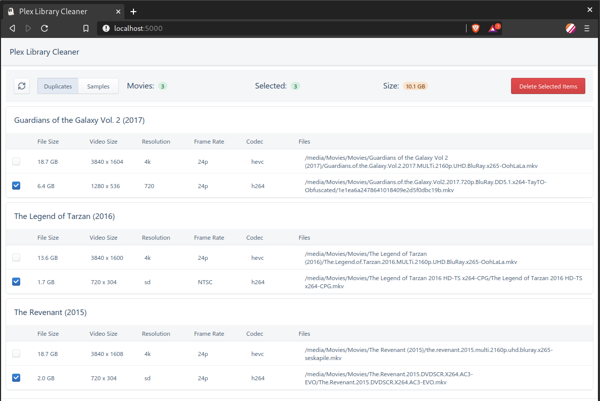
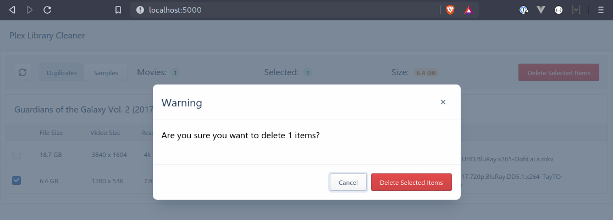

# Plex Library Cleaner

A simple UI to help find and delete duplicate and sample files from your Plex server.

>Note: At this time only Plex Movie Libraries are supported.

## Run with Docker

This project is available as a docker container on [Docker Hub](https://hub.docker.com/r/selexin/plex-library-cleaner).

To run with docker you need will need your Plex server address and
a valid Plex token: [How to find your Plex Token](https://support.plex.tv/articles/204059436-finding-an-authentication-token-x-plex-token/).

You can then run the container as follows, replacing `plex_ip_address`
and `plex_token` with your values:

```
docker run \
	-e PLEX_BASE_URL="http://plex_ip_address:32400" \
	-e PLEX_TOKEN="plex_token" \
	-p 5000:80 \
	selexin/plex-library-cleaner:latest
```

You can then access the UI in your browser at [http://localhost:5000/](http://localhost:5000/).

>Note: The access port must be set as `5000` (do not change this or things will not work).

## Screenshots






## Credits
Thanks to the following projects:
- [pkkid/python-plexapi](https://github.com/pkkid/python-plexapi)
- [tiangolo/uwsgi-nginx-flask-docker](https://github.com/tiangolo/uwsgi-nginx-flask-docker)

## License
MIT - see [LICENSE.md](https://github.com/se1exin/Plex-Library-Cleaner/blob/master/LICENSE.md)